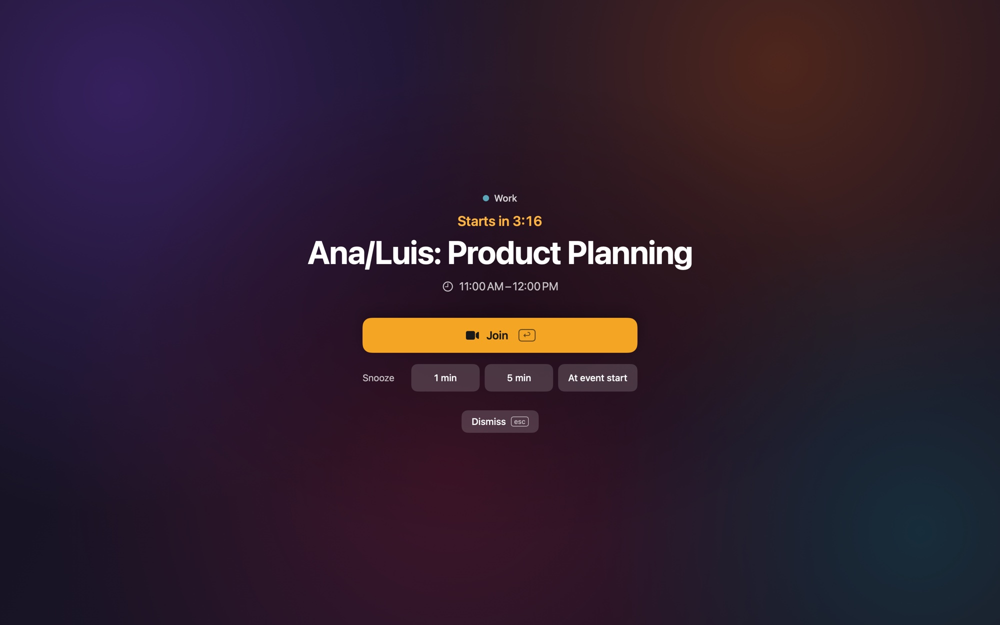
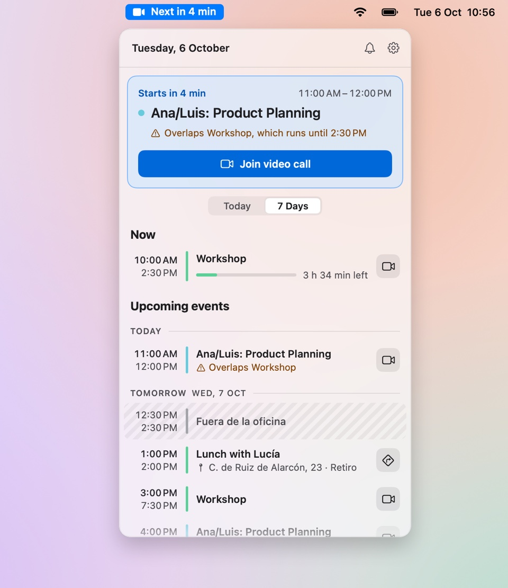
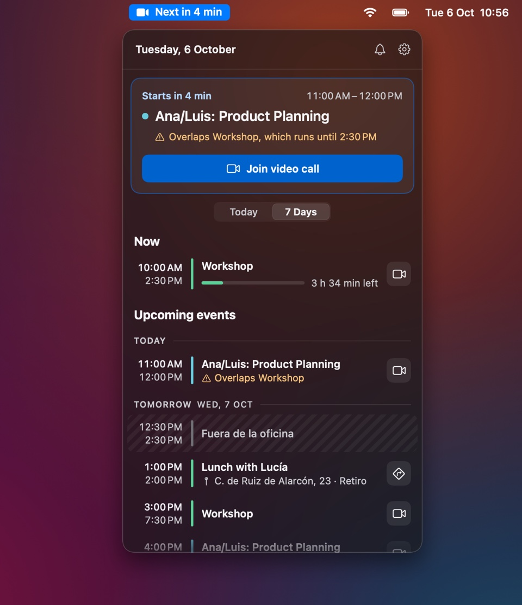
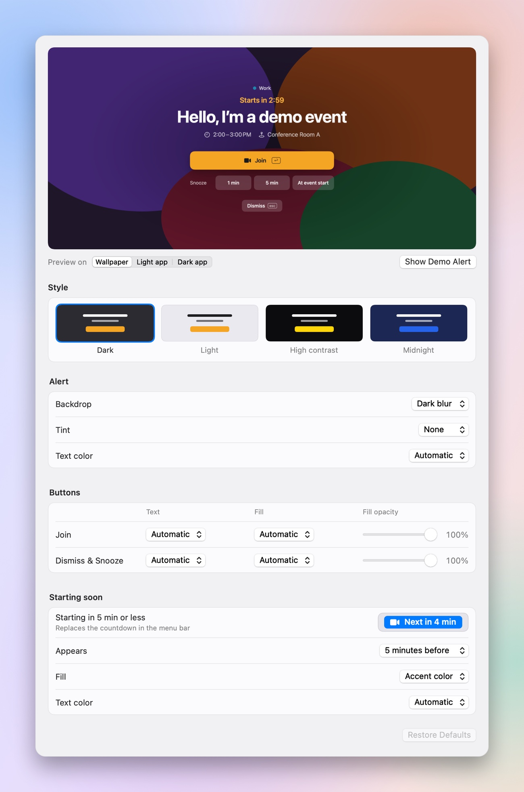

# Join!

[](#requirements)
[](Package.swift)
[](LICENSE)

A free, open-source macOS menu bar app that makes calendar meetings impossible to miss.

Join! watches the calendars on your Mac and, a few minutes before each meeting, puts a full-screen alert above everything you're doing, with a one-click button to join the call. The menu bar tells you how long until your next meeting, and a panel below it shows the rest of your day.

<p align="center">
  
</p>

## Features

- **Full-screen alert** a few minutes before each meeting, on every display (or just the main one, or the one with the pointer), above everything else. It shows a live countdown, the title, time and location, and buttons to Join, Snooze, snooze until the start, or Dismiss.
- **Menu bar item** that tells you where you are in your day: a countdown to the next meeting today ("Next in 11 h 40 min", "Next in 42 min") or its day and time ("Tomorrow at 1:00 PM", "In 3 days at 9:10 AM"), an accent pill when a meeting is about to start (5 minutes before by default), and a draining ring with "40 min left" during a meeting. Event titles are optional.
- **Menu bar panel** with one card for what matters now (starting soon, in progress, next, or nothing left today), then everything still to come today and in the coming days. Overlapping meetings are flagged, and a Today | 7 Days switch narrows the list to today. It's frosted glass that stays readable over any wallpaper or window, in light and dark mode.
- **One-click Join** for Google Meet, Zoom, Microsoft Teams and Webex links found in the event, and **Directions** in Apple Maps for in-person meetings.
- **Choose what counts**: tick the calendars Join! watches, and hide events nobody else is invited to, like focus time or reminders you add for yourself.
- **Pause reminders** for an hour, until tomorrow, or until you resume.
- **Configurable** lead time, snooze durations, auto-close, sound, and the alert's look: four presets, backdrop, tint, text and button colors (automatic by default), with contrast warnings, a live preview and a demo alert. The starting-soon pill's colors, and how long before a meeting it appears, are configurable too.
- **Updates in the app**: once a day Join! asks GitHub whether there's a new release. When there is, the menu bar panel says so, and **Install** downloads it, checks it, replaces the app and relaunches. A switch in Settings turns the daily check off.

Works with any calendar your Mac knows about (Google, iCloud, Exchange, Outlook, CalDAV) through macOS Calendar. Native Swift and SwiftUI, no third-party dependencies.

<p align="center">
  
  
</p>
<p align="center">
  
</p>
<p align="center"><sub>Screenshots show sample meetings, not a real calendar.</sub></p>

## Privacy

Join! reads your calendars on your Mac through Apple's EventKit and keeps them there: nothing about your calendars or meetings leaves your Mac. It has no accounts and no analytics.

It goes online only for updates. About once a day it sends one request to GitHub's API (`api.github.com`) asking for the latest Join! release. If that request fails, it tries again an hour later, or at the next launch. While an update is on offer, it also asks again each time Join! launches, to make sure the offer still stands. The only thing the request says about you is which version of Join! you run, in its User-Agent: its other headers, including a fixed English language header (`Accept-Language: en`), are the same on every Mac. GitHub also sees your IP address. To stop these checks, turn off **Check for updates automatically** in **Settings › General › Updates**; **Check Now** there still checks when you ask. **Install** downloads the new version from the project's [GitHub Releases](https://github.com/Poliuk/join/releases), with the same User-Agent and language header.

Links only open, in your browser or Apple Maps, when you click Join, Directions or Download Page.

## Requirements

- macOS 14 Sonoma or later
- To build: Xcode Command Line Tools (`xcode-select --install`). Full Xcode is only needed to run the unit tests.

## Install

Download **[Join.zip](https://github.com/Poliuk/join/releases/latest/download/Join.zip)** from the [latest release](https://github.com/Poliuk/join/releases/latest), open it, and move **Join.app** to your Applications folder. It runs on Apple silicon and Intel Macs. The app lives in the menu bar only; there is no Dock icon. Opening the app again while it runs opens Settings.

Join! is signed ad hoc but not notarized by Apple, so the first time you open a downloaded copy, macOS stops it ("Apple could not verify “Join” is free of malware…"):

1. Click **Done**.
2. Open **System Settings › Privacy & Security**, scroll down to **Security** and click **Open Anyway** next to "“Join” was blocked…". Confirm.

On macOS 14 Sonoma you can instead right-click Join.app and choose **Open**. You do this once for each version you download yourself; updates installed from inside Join! skip it.

### Updates

From 1.1.0 on, Join! checks for a new release once a day. When it finds one, the menu bar panel shows "Join! 1.2.0 is available" with **Install**, which downloads the new version from GitHub, checks it, replaces the app and relaunches Join!. Join! downloads it itself, so macOS doesn't quarantine it and there's no Open Anyway step. If Join! can't replace itself, for example because it runs from a folder you can't write to, it puts the new version in `~/Downloads/Join 1.2.0/`, shows it in Finder and says "Quit Join!, then move Join! 1.2.0 to Applications". A release that needs a newer macOS than yours is still offered, because GitHub doesn't say which macOS a release needs; once Install finds out, Settings says "Join! 2.0.0 needs macOS 15.0 or later" and that release isn't offered again. **Settings › General › Updates** shows when Join! last checked, has **Check Now**, and turns the daily check off.

Join! 1.0.0 doesn't check for updates, so update it by hand once: quit Join!, download the latest release, replace the app in Applications, and open it with Open Anyway as above.

Either way, macOS keeps the calendar permission: the signature is pinned to the bundle identifier, not to one build.

### Build from source

```sh
git clone https://github.com/poliuk/join.git
cd join
make run
```

This builds `build/Join.app` for your Mac and opens it. Move it to `/Applications` to keep it. To build without launching, `make app`. A copy you built yourself opens without the Gatekeeper step, and the calendar permission survives rebuilds too.

## First launch

1. macOS asks for calendar access. Approve it. If you miss the prompt, grant it in System Settings › Privacy & Security › Calendars.
2. Click the menu bar item → the gear → **Settings** → **Calendars** and untick the calendars you don't want alerts for (holidays, birthdays). To leave out events nobody else is invited to, such as focus time, turn off **Show events with no participants** under **General** › **Events**.
3. The default alert fires 3 minutes before each meeting. Change it under **General** › **Alert me**.

### Google Calendar

Join! reads calendars through macOS, so your Google account needs to be added in **System Settings › Internet Accounts** with *Calendars* enabled. How quickly changes from Google reach your Mac is controlled in **Calendar › Settings › Accounts › Refresh Calendars**; set it to *Every minute* or *Every 5 minutes* for best results.

## What gets alerted

Every event in the enabled calendars, except all-day events, cancelled events, events you declined, and out-of-office events. Tentative invitations do alert. In the menu bar and the panel's top card, though, a meeting you're attending (accepted, or your own) comes before a Maybe or unanswered one it overlaps: during a long Maybe block, the menu bar counts down to the call you accepted inside it from an hour before, shows that call while it runs, and goes back to the block afterwards. Out-of-office events are recognised by title ("Out of office", "Fuera de la oficina", "OOO", …). They show striped in the menu bar panel but don't alert; turn on **Settings › General › Out of office › Alert for out-of-office events** to be alerted for them too, turn off **Show out-of-office events in the list** to leave them out of the panel's lists, or edit the keywords there.

Events with no participants, the ones nobody else is invited to (focus time, reminders and holds you add for yourself), alert like any other by default. Turn off **Settings › General › Events › Show events with no participants** to leave them out everywhere: they don't alert and don't show in the menu bar or its panel, as if their calendar were unticked. That goes for out-of-office events with no participants too, whatever the out-of-office options say.

On the alert, **Return** joins the call and **Esc** dismisses. Keys are ignored for the first moment after the alert appears, so a keystroke you were already typing elsewhere can't dismiss it by accident.

If a meeting starts while an alert is due (the Mac was asleep, the app was launched late), the alert fires immediately, unless the meeting started more than 5 minutes ago.

To take a break, click the bell in the menu bar panel and pick **Pause for 1 hour**, **Pause until tomorrow** or **Pause until I resume**. The menu bar shows a crossed-out bell while paused, and the pause survives a relaunch.

## Development

```sh
swift build          # debug build (Command Line Tools are enough)
swift test           # unit tests (needs Xcode for XCTest)
scripts/build-app.sh # assemble build/Join.app
make icon            # redraw Resources/AppIcon.icns after changing scripts/make-icon.swift
```

The package has two targets:

- `JoinCore` — pure logic with no UI, EventKit or network dependency: scheduling, link detection, time formatting, preferences, what the menu bar item and panel say, the alert's countdown, colors and contrast, and which GitHub release counts as an update. This is what the tests cover.
- `Join` — the app: EventKit calendar service, alert windows, menu bar item and panel, Settings, and the updater.

To check the UI against a known calendar instead of your own, quit Join! and launch it with a fixture scenario (`nothing`, `later`, `busy`, `meeting`, `maybe` or `denied`):

```sh
open --env JOIN_FIXTURE=busy build/Join.app
```

Fixture runs keep their settings in a separate defaults domain, never schedule alerts, show a "Fixture" marker, and quit after two hours. They don't go online for updates either: `JOIN_FIXTURE_UPDATE` picks what the update check finds: `current` (the default, no update), `available` (a fake newer version) or `failed`, and **Install** isn't available. These runs keep the check's results in memory only, so each launch checks once, straight away, whatever an earlier fixture run found. `JOIN_FIXTURE_UPDATE=live` asks GitHub for real and lets Install replace the app the fixture runs from, for testing updates end to end.

```sh
open --env JOIN_FIXTURE=busy --env JOIN_FIXTURE_UPDATE=available build/Join.app
```

Only fixture runs listen for a few distributed notifications (`com.poliuk.join.fixture.openSettings`, `snapshot`, `togglePanel`, `pause`, `appearance`, `checkForUpdates`, …) so scripts can open windows, take snapshots, switch light/dark and check for updates; a normal run ignores them. See [Testing strategy](docs/TECHNICAL_DESIGN.md#12-testing-strategy) in the technical design.

The [product brief](docs/PRODUCT_BRIEF.md) and the [technical design](docs/TECHNICAL_DESIGN.md) explain what the app does and how it's built.

### Releases

Commits to main never publish a release; pushing a version tag does. `make release VERSION=1.1.0` sets the version, tags `v1.1.0` on main and, after asking, pushes. GitHub Actions then runs the tests, builds a universal Join.app and attaches `Join.zip` to a new release. Installed copies of Join! 1.1.0 and later offer each new release within a day. [Releasing](docs/RELEASING.md) covers the branch model, version numbers and what to do when a release fails.

## Contributing

Issues and pull requests are welcome. Work on a branch and open a pull request against `main`; CI builds and tests it. Keep `JoinCore` free of UI, EventKit and network code, add tests there for new logic, and update the docs in `docs/` when behavior changes.

## License

MIT. See [LICENSE](LICENSE).
